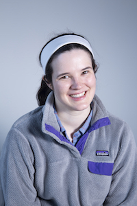
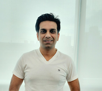

# AI For Mankind

AI For Mankind is a 501(c)(3) nonprofit organization with the mission of mobilizing the tech community to work on world challenging problems using AI and Data. We organize tech talks, workshops, and hackathons. We want to build a grassroot community of volunteers creating solutions using AI and Data to bring positive impacts to society at large. 

Together we can make things happen !

AI For Mankind was founded by [Wei Shung Chung](https://www.linkedin.com/in/wei-shung-chung-01326a7/) as a [meetup group](https://www.meetup.com/AI-for-Mankind/) in April 2018. It was registered as a nonprofit organization in May 2019.

## Join Our Slack Channel
- [AI For Mankind Slack Channel](https://tinyurl.com/vch2z68)

## Join Our Meetup Group
- [Join AI For Mankind Meetup Group](https://www.meetup.com/AI-for-Mankind/) to receive event announcement.

## Youtube Channel
- [Presentations](https://www.youtube.com/channel/UCyosmgDqG3jfZ4_aYsN94Lw)

## Upcoming Events
- [Lets Annotate Wildfire Smoke Images](https://www.meetup.com/AI-for-Mankind/events/270718685/) May 30 at 10 am Pacific Time
- [Lets Stop Wildfires Hackathon 2.0](https://aiformankind.org/lets-stop-wildfires-hackathon-2.0/) to build deployable wildfire smoke detector. Register [Now](https://forms.gle/wM7zRPFMUQptpygX9)

## Learning Materials
- [Wildfire Smoke Detection Colab Notebook](https://github.com/aiformankind/lets-stop-wildfires-hackathon/blob/master/Challenge_1B_WildfireSmokeImageClassifierForDemo.ipynb). We built this wildfire smoke classification notebook as a quickstart notebook for our [Lets Stop Wildfires Hackathon](https://aiformankind.org/lets-stop-wildfires-hackathon/). However you can adapt it easily to classify other types of images.
- [Covid-19 Data Exploratory Notebooks](data_exploratory_notebooks.md) contributed by our volunteers and participants of our hackathons.

## Our Projects
- **Seeing the World Project** to build a more accessible and navigable physical world for people who are blind or have low vision. 
  
  Take and share fruit or vegetable pictures taken via your mobile phone with us. Click here [seeingtheworld.live](https://seeingtheworld.live/) to submit.
  
  You can test out our fruit and veggie classifier [here](https://fruit-veggie-classifier.azurewebsites.net/).
   
  
  
  
  
  
   
   
  Download our curated fruit and veggie [dataset](https://www.dropbox.com/s/ebcmhynglu23zd9/fruit_veggie_farmermarket_grocerystore.tar.gz).
  
  We are proud to be selected as one of the [Microsoft AI for Accessibility's grantees](https://www.microsoft.com/en-us/ai/ai-for-accessibility). [Read our project blog](https://medium.com/@ai.for.mankind/seeing-the-world-project-ef3cc5fd692a)

  [Seeing the World Project Github](https://github.com/aiformankind/seeing-the-world)

 

- **Wildfires Smoke Detection Project** to investigate and promote the use of AI Deep Learning in early wildfire smoke detection. We want to raise awareness about the crisis and rally more people/AI experts to work on this problem. We continue to promote the curation of open datasets to speed up research and development. We collaborate with [HPWREN](http://hpwren.ucsd.edu/) in promoting the collaboration of our volunteers from private tech with public sector in solving this wildfire crisis.

  [2019 Lets Stop Wildfires Hackathon](https://aiformankind.github.io/lets-stop-wildfires-hackathon/)
  
- **Healthcare: Combat Covid-19 Pandemic Project** We organize series of online hackathons to work on ideas and build useful applications to help everyone in combating Covid-19. [See contributions by our participants](https://aiformankind.org/covid-19-hackathon/#exploratory-data-analysis-notebooks-built-by-hackathon-participants).

Once again, thank you to all our volunteers for their dedication and contribution. 

## Past Hackathons
* [Covid-19 Online Hackathon](https://aiformankind.github.io/covid-19-hackathon/)

  - 1st Covid-19 Online Hackathon, Saturday March 14, 2020
      - Hackathon Mentor: [Ivana Williams](https://www.linkedin.com/in/ivanajw/) Staff Research Scientist at Chan Zuckerberg Initiative

  - 2nd Covid-19 Online Hackathon: Work on COVID-19 Open Research Dataset, Saturday March 21, 2020  
    
  - 3rd Covid-19 Online Hackathon Saturday April 4, 2020 at 10 am Pacific Time

  - 4th Covid-19 Online Hackathon Saturday April 18, 2020 at 10 am Pacific Time
  
  
* [Lets Stop Wildfires Hackathon](https://aiformankind.github.io/lets-stop-wildfires-hackathon/)

  - Special thanks to our Hackathon Mentors for providing guidances to the participants of Lets Stop Wildfires Hackathon.
  
    - [Adam Kraft](https://www.linkedin.com/in/adam-kraft-7555b534/) Machine Learning Engineer from Google Brain
    - [Anna Bethke](https://www.linkedin.com/in/annabethke/), Head of AI for Social Good for Intel
    - [Jianming Zhang](https://www.linkedin.com/in/jianming-zhang-60762227/), Senior Research Scientist from Adobe Research
    - [Jigar Doshi](https://www.linkedin.com/in/jigarkdoshi/), Senior Researcher at Senior Researcher at Wadhwani AI
    - [Kinshuk Govil](https://www.linkedin.com/in/kinshuk-govil-0080522/), Lead for Machine Learning based early wildfire detection system
    - [Tim Ball](https://www.linkedin.com/in/tim-ball-1832a824/), President of [Fireball International](http://www.fireballit.com/)
    - [Vladimir Iglovikov](https://www.linkedin.com/in/iglovikov/) Kaggle Grandmaster, Senior Computer Vision Engineer at Level5, Self-Driving Division, Lyft Inc.

 
 

See more event [pictures](https://www.meetup.com/AI-for-Mankind/photos/).

## Donate
Your tax-deductible [donation](https://donorbox.org/donate-to-ai-for-mankind?default_interval=o) today will help support our mission.

AI For Mankind is a 501(c)(3) nonprofit organization. EIN 84-1750651

## Past Events
- [Deep Learning Tech Talks](https://www.meetup.com/AI-for-Mankind/events/265983290/) 

  - Albumentations: fast and flexible image augmentations
  - FUEGO Early Fire Detection
  - Deep Learning Based Large-scale Histological Tau Protein Mapping for Neuroimaging Biomarker Validation in Alzheimer's Disease]
  
- [Deep Learning Based Wildfire Detection](https://www.meetup.com/AI-for-Mankind/events/264775120/)
- [xBD Large Scale Satellite Imagery + Hotels50K datasets](https://www.meetup.com/AI-for-Mankind/events/262698783/)
- [Demand and Opportunities in the Tech-Fashion Industry](https://www.meetup.com/AI-for-Mankind/events/260788457/)
- [Robot Navigation + Human In the Loop NLP](https://www.meetup.com/AI-for-Mankind/events/259397222/)

  - Robot navigation with automated reinforcement learning
  - Detecting Political Narratives with Human-in-the-loop NLP
  
- [Satellite Imagery for Humanitarian Efforts and Social Entrepreneurship Contest](https://www.meetup.com/AI-for-Mankind/events/258212858/)
- [Building Unprejudiced Datasets for AI](https://www.meetup.com/AI-for-Mankind/events/254001396/)
- [Computer Vision for Satellite Images. How to use them for social good ](https://www.meetup.com/AI-for-Mankind/events/252659075/)

## Past Speakers
- [Ivana Williams](https://www.linkedin.com/in/ivanajw/) Staff Research Scientist at Chan Zuckerberg Initiative
- [Jigar Doshi](https://www.linkedin.com/in/jigarkdoshi/) Senior Researcher at Senior Researcher at Wadhwani AI
- [Kinshuk Govil](https://www.linkedin.com/in/kinshuk-govil-0080522/) Machine Learning Lead for Wildfire Smoke Detection
- [Vladimir Iglovikov](https://www.linkedin.com/in/iglovikov/) Senior Computer Vision Engineer at Level5, Self-Driving Division, Lyft
- [Maryana Alegro](https://www.linkedin.com/in/maryana/) Machine Learning and Computer Vision Engineer
- [Nirav Patel](https://www.linkedin.com/in/npatel08/) Geospatial Data Scientist & Project Manager, Space & AI/ML Portfolios at United States Department of Defense
- [Jonathan Brandt](https://www.linkedin.com/in/jonathan-brandt-23b334/) Adobe Fellow and the Director of the Media Intelligence Lab at Adobe Research
- [Kitty Y. M. Yeung](https://www.linkedin.com/in/kittyyeung1/) Senior Program Manager - Quantum Computing at Microsoft
- [Aleksandra Faust](https://www.linkedin.com/in/aleksandrafaust/) Deep Reinforcement Learning Researcher at Google Research with Google Brain
- [Olya Gurevich](https://www.linkedin.com/in/ogurevich/) Co-founder/Chief Scientist at Marvelous AI
- [Adam Kraft](https://www.linkedin.com/in/adam-kraft-7555b534/) Machine Learning Engineer at Google Brain
- [Rebecca Krauthamer](https://www.linkedin.com/in/rkrauthamer/) CEO at Quantum Thought
- [Haichun Chen](https://www.linkedin.com/in/haichun-chen-7a378b3/) Manager, Content Knowledge, Data Science and Engineering at Netflix

## Meet Our Volunteers
#### [Rachael Creager](https://www.linkedin.com/in/rccreager/) Artificial Intelligence Fellow at Insight Data Science

>*"I joined AI For Mankind for the CORD-19 NLP hackathon, where I am working on improving search engines and topic modeling for Covid-19 researchers. I chose this project for its usefulness as well as for the learning experience."*

>*"It feels good to work on something bigger than yourself while learning skills you can use for the future!"*

>*"AI For Mankind is also a great place to meet other technologists and to get exposure to different tools and ideas. The discussions during the hackathon lead me to try methods for topic modeling which I previously knew nothing about!"*

#### [Kaniska Mandal](https://www.linkedin.com/in/kaniskamandal/) Tech Lead, Search Science and Marketing Demand Optimization Team at Walmart Labs 

>*"There is a massive demand for developing open source projects for mankind all over the world. AI For Mankind provides such a platform where knowledge-seekers, mentors, instructors and hackers can engage together for sharing knowledge and building apps for social goods."*

>*"I believe AI For Mankind has a great vision, proven execution strategy, long-term goals and unique combination of domain expertise and AI Experience."*

>*"As an active member I could make a direct impact by working on algorithms for detecting wild-fire. Now we have a bigger responsibility to help humanity containing the spread of Covid19."*

#### [Matt Tso](https://www.linkedin.com/in/matttso/) Neuroscience Post Doc, University of California, Berkeley

>*"I joined AI For Mankind to sharpen my skills in AI and networking. And overall, I just love the idea to volunteer my skills for a good cause."* 

>*"My amateur AI/data science projects include COVID19 cases and demographic analysis, wildfire image classification and predicting bad loans from Freddie Mac data"*

#### [Amit Doda](https://www.linkedin.com/in/amit-doda/) Data Scientist, Adobe India
##### First Place Winner of [Lets Stop Wildfires Hackathon](https://aiformankind.org/lets-stop-wildfires-hackathon/)

>*"AI For Mankind is a great community with highly motivated and intellectual people working for the social good."* 

>*"When I came across this hackathon - Early Wildfire Smoke Detection using Deep Learning skills, I was so tempted to participate as I could see a great opportunity to use my skills and take up a problem which is so real and meaningful to solve."* 

>*"And there is nothing better than seeing your model deployed and tested on actual sites and seeing it help tackle a problem so big such as wildfires crisis. If that happens it would be doing my bit for the Environment."*

#### [Anil Berry](https://www.linkedin.com/in/anil-berry-58835b1a/) Lead Software Engineer, Adobe, India

>*"My motivation for joining AI For Mankind is the collaboration, learning from each other, and to contribute in 
solving real world challenges using data science and machine learning."*

 

#### [Davies Odu](https://www.linkedin.com/in/davodu/) Software Developer, Microsoft

>*"I joined AI for Mankind because I’m very excited about the economic and social advantages that AI and big data will bring to humanity how it might be leveraged with wisdom to improve the lives of ALL humans."*

>*"AI for Mankind brings developers and enthusiasts together with a strong vision to leverage AI for specific solutions that improve the human experience and this strongly motivates me to bring in my skills and learn from like minds."*

#### Aarnav Sawant, High school freshman at Bellarmine College Preparatory

>*"The world is definitely changing first with Wildfires and now with COVID-19. AI For Mankind has done exceedingly great work to help find solutions to these real-world problems, and I hope to contribute to this cause and help make this world a better place. I have most recently been working on a Deep Learning project to diagnose COVID-19 using Chest X-Ray Images."*

[You can learn more about our awesome volunteers here.](meet_our_volunteers.md)

## Volunteer Your Skills
AI For Mankind is looking for tech savvy developers to volunteer their skills. If you are web developer, mobile developer, UI/UX, data scientist/AI experts etc, please volunteer your skills and fill out this [form](https://forms.gle/nbr36bM7tYWYdTqk7).

## Become a Mentor
[Join to become one of our mentors](https://forms.gle/L4JLz3g8jyT1rptS9) to provide guidance and expertise to help our volunteers.

## Our Sponsors
  

## Become Our Sponsors
[Reach out to us](https://forms.gle/ZZZbxTmYpFoHheb7A) if you are interested in becoming our sponsors.

## Donate
Your tax-deductible [donation](https://donorbox.org/donate-to-ai-for-mankind?default_interval=o) today will help support our mission.

AI For Mankind is a 501(c)(3) nonprofit organization. EIN 84-1750651
