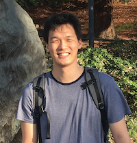

# Meet Our Volunteers
Meet and learn about our awesome AI For Mankind's volunteers ! Thank you for their continued supports and contributions. Without our volunteers, our success wouldn’t have been possible.

## [Rachael Creager](https://www.linkedin.com/in/rccreager/) 
### Artificial Intelligence Fellow at Insight Data Science

#### Why I Joined AI For Mankind
>I joined AI For Mankind for the CORD-19 NLP hackathon, where I am working on improving search engines and topic modeling for Covid-19 researchers. 
I chose this project for its usefulness as well as for the learning experience. It feels good to work on something bigger than yourself while learning skills you can use for the future! 

>AI For Mankind is also a great place to meet other technologists and to get exposure to different tools and ideas. 
The discussions during the hackathon lead me to try methods for topic modeling which I previously knew nothing about!

#### Bio
>I defended my PhD in experimental particle physics at the University of Pennsylvania in December 2019. 
My thesis research was focused on data pipeline improvements and classification algorithm performance evaluation 
at the Large Hadron Collider. 

>After defending, I accepted an Artificial Intelligence Fellowship at Insight Data Science, where I developed a facial recognition “privacy filter” and testing suite for privatizing images. 
I have a strong background in data engineering as well as open-ended research.

## [Kaniska Mandal](https://www.linkedin.com/in/kaniskamandal/) 
### Tech Lead, Search Science and Marketing Demand Optimization Team at Walmart Labs 

#### Why I Joined AI For Mankind
>There is a massive demand for developing open source projects for mankind all over the world. 
AI For Mankind provides such a platform where knowledge seekers, mentors, instructors and hackers can engage together for 
sharing knowledge and building apps for social goods. 

>I believe AI For Mankind has a great vision, proven execution strategy, long-term goals and unique combination of domain expertise 
and AI Experience. 

>As an active member I could make a direct impact by working on algorithms for detecting wild-fire. Now we have a bigger responsibility 
to help humanity containing the spread of Covid-19. 

>I am very much excited to contribute to the ideas and implementation strategies for analyzing social data and unstructured signals in order to detect outbreaks , symptoms, availability and demand of medical kits, mental anxiety patterns followed by timely actions and alerts.
I am also focussing on another project on analyzing images for classifying flu-like and covid-19 symptoms.

>I feel humbled to be part of AI For Mankind’s journey.

#### Bio
>I have been developing Machine Learning Algorithms, Data Engineering Pipelines, Analytics Platforms, Tools in the domain of Retail, CRM, 
Finance, Marketing, Algorithmic Trading, Smart Networking, IIOT and Healthcare for various startups and Enterprises over the last 20 yrs. 

>At present I am a Tech Lead in the Search Science and Marketing Demand Optimization team of Walmart Labs 
building ML Algorithms, Experimentation platforms, Actionable analytics and Big data pipelines.

## [Matt Tso](https://www.linkedin.com/in/matttso/)
### Neuroscience Post Doc, University of California, Berkeley

#### Why I Joined AI For Mankind
>I joined AI For Mankind to sharpen my skills in AI and networking. And overall, I just love the idea to volunteer my skills 
for a good cause. 

#### Bio
>At UC-Berkeley, I am studying brain circuits that controls sleep and wake in mice. My amateur AI/data science projects include COVID19 cases and demographic analysis, wildfire image classification and predicting bad loans from Freddie Mac data.

## [Amit Doda](https://www.linkedin.com/in/amit-doda/) 
### Data Scientist, Adobe, India

#### Why I Joined AI For Mankind
>AI For Mankind is a great community with highly motivated and intellectual people working for the social good. 

>When I came across this hackathon - Early Wildfire Smoke Detection using Deep Learning skills, I was so tempted to participate
as I could see a great opportunity to use my skills and take up a problem which is so real and meaningful to solve. 

>The other unique trait about this hackathon is that it just doesn’t end here instead the winning model would be 
further fine-tuned and taken to actual site. 

>And there is nothing better than seeing your model deployed and tested on actual sites and seeing it help tackle a problem so big such as wildfires crisis. 
If that happens it would be doing my bit for the Environment.

#### Bio
>I am working as a Data Scientist in Adobe and I get to work on various machine learning use cases across different Industries. 
Among all the domains, computer vision is my favorite and I am a big fan of all the good advancements that 
have happened in this space over the last 5 years. 

>Deep Learning is helping address many critical use cases in the vision domain such as image classification, 
object detection, image generation, super resolutions and the list just goes on.

## [Anil Berry](https://www.linkedin.com/in/anil-berry-58835b1a/)
### Lead Software Engineer, Adobe, India

#### Why I Joined AI For Mankind
>My motivation for joining AI For Mankind is the collaboration, learning from each other, and to contribute in 
solving real world challenges using data science and machine learning.

## Join Us
- [AI For Mankind Slack Channel](https://tinyurl.com/vch2z68)
- [AI For Mankind Meetup Group](https://www.meetup.com/AI-for-Mankind/)
